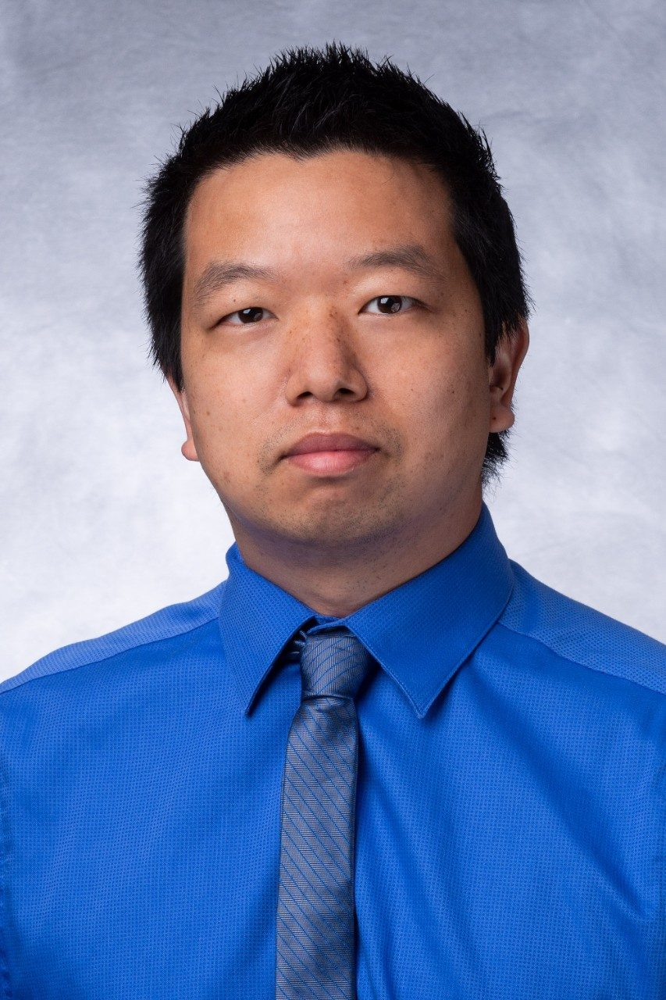

---
#
# By default, content added below the "---" mark will appear in the home page
# between the top bar and the list of recent posts.
# To change the home page layout, edit the _layouts/home.html file.
# See: https://jekyllrb.com/docs/themes/#overriding-theme-defaults
#
layout: home
---

  <h3>Work on</h3>
  <h1>Foundation AI Models in Biomedical Imaging</h1>
  <h3>Workshop at</h3>
  <h3><a href="https://conferences.leeds.ac.uk/miua/">IEEE International Conference on Biomedical Imaging (ISBI) 20205</a></h3>
  

# About
Add about text here

# Invited Speakers
Invited speakers to be added here as below ()

  

    
    
<strong>Dr. Hazrat Ali</strong>

    
University of Stirling, UK

  

  

    
    
<strong>Dr. Rizwan Qureshi</strong>

    
University of Central Florida, USA

  

# Organizers

  

    
    
<strong>Dr. Hazrat Ali</strong>

    
University of Stirling, UK

  

  

    
    
<strong>Dr. Rizwan Qureshi</strong>

    
University of Central Florida, USA

  

  

    
    
<strong>Dr. Islem Rekik</strong>

    
Affiliation

  

  

    
    
<strong>Prof. Jia Wu</strong>

    
Affiliation

  
 

# Schedule
To be announced. 

# Contact us
**Dr. Hazrat Ali**, ali.hazrat@stir.ac.uk 

---

# Organizers' affiliations

  

    
  

  

    
  

  

    
  

---

